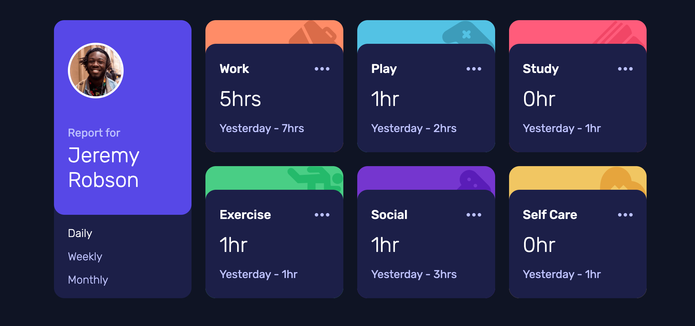

# Time tracking dashboard

This is a solution to the [Time tracking dashboard challenge on Frontend Mentor](https://www.frontendmentor.io/challenges/time-tracking-dashboard-UIQ7167Jw). 

✨ Here is the live site URL:

## The challenge

Users should be able to:

- View the optimal layout for the site depending on their device's screen size
- See hover states for all interactive elements on the page
- Switch between viewing Daily, Weekly, and Monthly stats

## Expected behaviour

- The text for the previous period's time should change based on the active timeframe. For Daily, it should read "Yesterday" e.g "Yesterday - 2hrs". For Weekly, it should read "Last Week" e.g. "Last Week - 32hrs". For monthly, it should read "Last Month" e.g. "Last Month - 19hrs".

## Screenshot 📷

## Built with 🔧
- HTML
- CSS grid
- SCSS
- JavaScript

## Useful Links
[A Complete Guide to Grid](https://css-tricks.com/snippets/css/complete-guide-grid/)