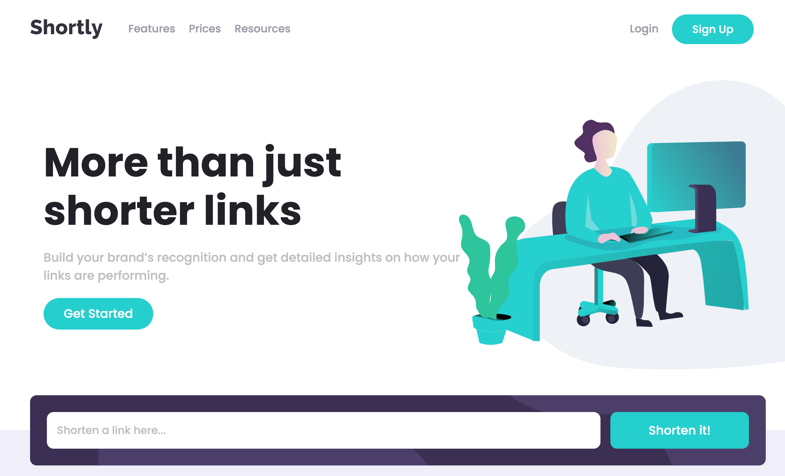

# Shortly URL shortening API Challenge solution

This is a solution to the [Shortly URL shortening API Challenge challenge on Frontend Mentor](https://www.frontendmentor.io/challenges/url-shortening-api-landing-page-2ce3ob-G).

✨ Here is the live site URL:

## The challenge

Users should be able to:

- View the optimal layout for the site depending on their device's screen size
- Shorten any valid URL
- See a list of their shortened links, even after refreshing the browser
- Copy the shortened link to their clipboard in a single click
- Receive an error message when the `form` is submitted if:
- The `input` field is empty

## Screenshot

;

## Built with 🔧

- HTML
- SCSS
- Vanilla JavaScript

## Notes

### Copy Text to Clipboard

```
// COPY
navigator.clipboard.readText(text);

// Paste
navigator.clipboard.readText(text);
```

### Useful Links
[MDN--Interact with clipboard](https://developer.mozilla.org/en-US/docs/Mozilla/Add-ons/WebExtensions/Interact_with_the_clipboard)


## Resources
[Shrtco](https://shrtco.de) - url shortening API
[Font Awesome](https://fontawesome.com) - hamburger & footer social media icons