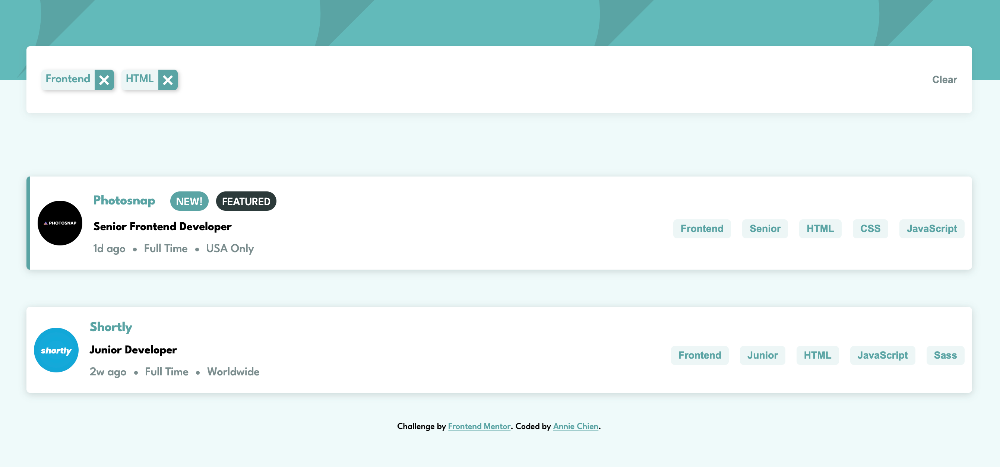

# Job listings with filtering

This is a solution to the [Job listings with filtering challenge on Frontend Mentor](https://www.frontendmentor.io/challenges/job-listings-with-filtering-ivstIPCt).

✨ Here is the live site URL: https://fementor-job-listings.netlify.app

## The challenge

Your users should be able to:

- View the optimal layout for the site depending on their device's screen size
- See hover states for all interactive elements on the page
- Filter job listings based on the categories

## Filtering

Use the [data.json](./data.json) file to pull the data and then dynamically add the content. This would be perfect if you're looking to practice a JS library/framework like React, Vue, or Svelte.

To add a filter, the user needs to click on the tablets on the right-side of the listing on desktop or the bottom on mobile. For each filter added, only listings containing all selected filters should be returned.

## Screenshot 📷

## Built with 🔧
- HTML
- [styled components](https://styled-components.com)
- [React](https://reactjs.org)
