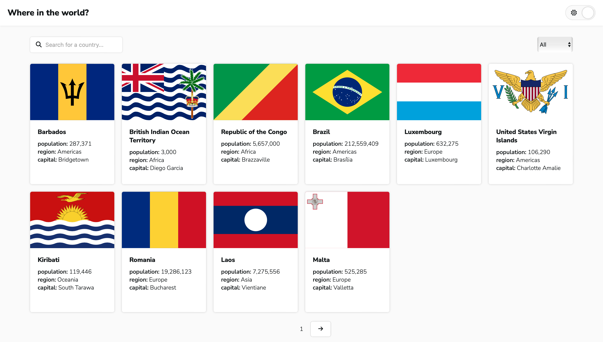
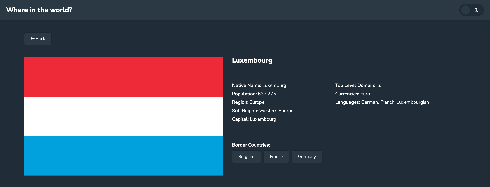

#  REST Countries API with color theme switcher
This is a solution to the [REST Countries API with color theme switcher challenge on Frontend Mentor](https://www.frontendmentor.io/challenges/rest-countries-api-with-color-theme-switcher-5cacc469fec04111f7b848ca). 

✨ Here is the live site URL:

## The challenge

Your users should be able to:

- See all countries from the API on the homepage
- Search for a country using an `input` field
- Filter countries by region
- Click on a country to see more detailed information on a separate page
- Click through to the border countries on the detail page
- Toggle the color scheme between light and dark mode *(optional)*

## Screenshot 📷

## Built with 🔧
- [styled components](https://styled-components.com)
- [React](https://reactjs.org)
- [React Router](https://reactrouter.com/en/main)
- [TanStack Query v4](https://tanstack.com/query/v4/?from=reactQueryV3&original=https://react-query-v3.tanstack.com/)
- [Rest Countries API](https://restcountries.com/#api-endpoints-v3-all)

## Resources
undraw: 404 page illustration
https://undraw.co/search

Convert code to country name
https://www.npmjs.com/package/i18n-iso-countries
