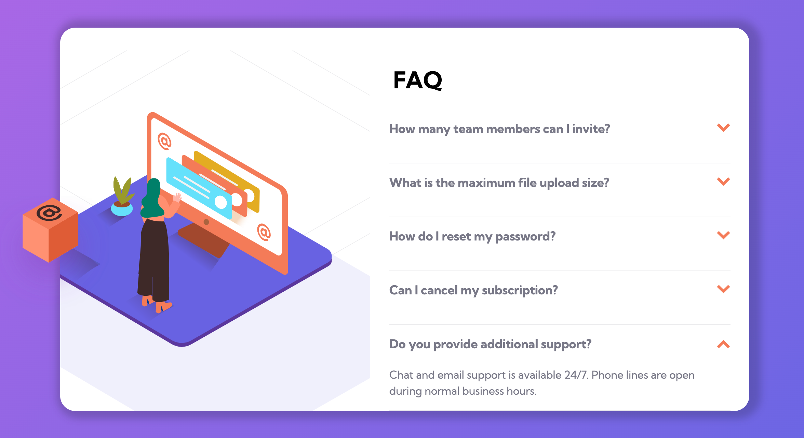

# Frontend Mentor - FAQ accordion card

This is a solution to the [FAQ accordion card challenge on Frontend Mentor](https://www.frontendmentor.io/challenges/faq-accordion-card-XlyjD0Oam).

✨ Here is the live site URL: https://fementor-accordion-faq.netlify.app

## The challenge
Users should be able to:

- View the optimal layout for the component depending on their device's screen size
- See hover states for all interactive elements on the page
- Hide/Show the answer to a question when the question is clicked
- **Bonus**: Complete the challenge without using JavaScript

## Screenshot 📷


## Built with 🔧
- HTML
- CSS

## Notes

To build a FAQ accordion card without using JavaScript, the solution I can think of is using **radio buttons** OR **checkboxes**. In this way, we can take the advantage of CSS `:checked` pseudo-class to achieve the show/hide effect.

I've build a similar FAQ card with **checkboxes** before. **Checkboxes** are perfect for the toggle effect. 

The reason why I deicided to use **radio buttons** instead of checkboxes is that I want to <ins>show one FAQ at a time</ins>. (Only one radio button in a set can be selected at the same time.)

However, there's a dowside of using the radio buttons...you CANNOT close it 😩. I mean, if you click a button that is alread clicked, nothing will happen. 

In my opion, to build a better accordion FAQ (toggle effect + open one FAQ at a time), JavaScript is a must. haha 


```css
/* hide the radio buttons */
input[type='radio'] {
  display: none;
}

/* set the initial state of the answer box to be 0 height */
.answer {
  max-height: 0;
  overflow: hidden;
  transition: all 0.5s;
}

/* when the radio button is checked --> expand the answer box (height > 0) */
input[type='radio']:checked ~ .answer {
  max-height: 100px;
}

/* when the radio button is checked --> rotate the arraow icon */
input[type='radio']:checked ~ .toggle-btn img {
  transform: rotate(180deg);
}
```
