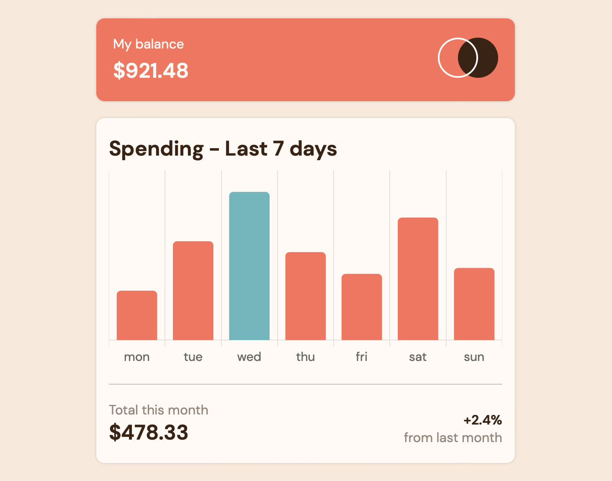

#  Expenses chart component

This is a solution to the [Expenses chart component challenge on Frontend Mentor](https://www.frontendmentor.io/challenges/expenses-chart-component-e7yJBUdjwt). 

✨ Here is the live site URL: https://fementor-accordion-faq.netlify.app

## The challenge

Your users should be able to:

- View the bar chart and hover over the individual bars to see the correct amounts for each day
- See the current day's bar highlighted in a different colour to the other bars
- View the optimal layout for the content depending on their device's screen size
- See hover states for all interactive elements on the page
- **Bonus**: See dynamically generated bars based on the data provided in the local JSON file

## Screenshot 📷

## Built with 🔧
- HTML
- SASS
- JavaScript
- [Chart.js](https://www.chartjs.org)

