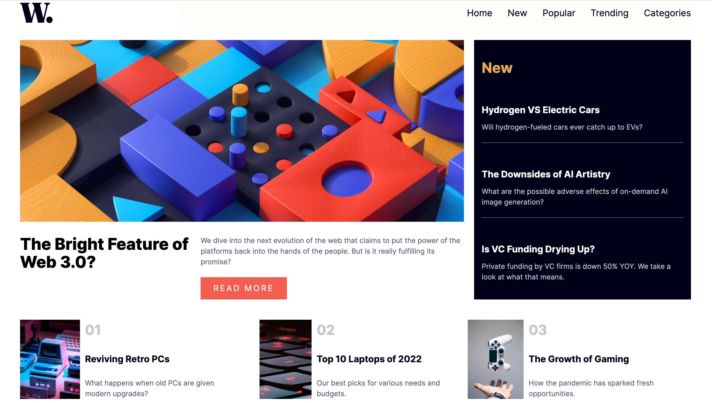

# News homepage

This is a solution to the [News homepage challenge on Frontend Mentor](https://www.frontendmentor.io/challenges/news-homepage-H6SWTa1MFl).

✨ Here is the live site URL:

## The challenge

Users should be able to:

- View the optimal layout for the interface depending on their device's screen size
- See hover and focus states for all interactive elements on the page
- Toggle the mobile menu (requires some JavaScript)

## Screenshots 📷

## Built with 🔧
- HTML
- CSS grid
- CSS flexbox
- Vanilla JavaScript