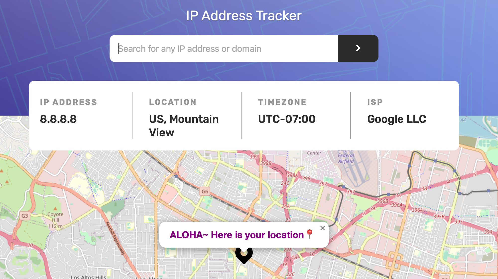

# IP address tracker

This is a solution to the [IP address tracker challenge on Frontend Mentor](https://www.frontendmentor.io/challenges/ip-address-tracker-I8-0yYAH0).

✨ Here is the live site URL:https://fementor-url-shortening-page.netlify.app

## The challenge
Your users should be able to:

- View the optimal layout for each page depending on their device's screen size
- See hover states for all interactive elements on the page
- See their own IP address on the map on the initial page load
- Search for any IP addresses or domains and see the key information and location

## Screenshot 📷


## Built with 🔧
- HTML
- SCSS
- Vanilla JavaScript
- [IPify](https://geo.ipify.org/)
- [LeafletJS](https://leafletjs.com/)

## Notes

### Validate a domain name

```javascript
const isDomain = (str) => {
  if (!str) return false;
  const regex =
    /(?:[a-z0-9](?:[a-z0-9-]{0,61}[a-z0-9])?\.)+[a-z0-9][a-z0-9-]{0,61}[a-z0-9]/g;
  return regex.test(str);
};
```

[Stackoverflow](https://stackoverflow.com/questions/10306690/what-is-a-regular-expression-which-will-match-a-valid-domain-name-without-a-subd/30007882#30007882)
[Regexr](https://regexr.com/3au3g)

