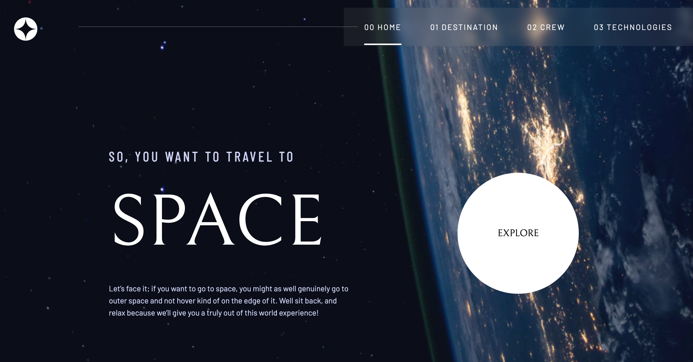

# Space tourism website

This is a solution to the [Space tourism website challenge on Frontend Mentor](https://www.frontendmentor.io/challenges/space-tourism-multipage-website-gRWj1URZ3).

✨ Here is the live site URL: https://fementor-space-website.netlify.app/destination

## The challenge

Your users should be able to:

- View the optimal layout for each of the website's pages depending on their device's screen size
- See hover states for all interactive elements on the page
- View each page and be able to toggle between the tabs to see new information

## Screenshots 📷

## Built with 🔧

- React
- React Router
- CSS Modules
- SCSS
- Framer motion (React Animation Library)

## Note

Bellefair google font 在畫面上的呈現怪怪的
解決方法：設定 font-weight 為 400
參考：https://stackoverflow.com/questions/72577560/character-issue-with-the-bellefair-google-font
