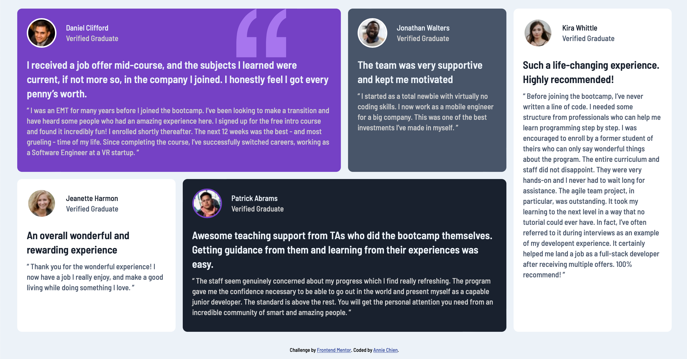

# Testimonials grid section

This is a solution to the [Testimonials grid section challenge on Frontend Mentor](https://www.frontendmentor.io/challenges/testimonials-grid-section-Nnw6J7Un7).

✨ Here is the live site URL: https://fementor-testimonials-grid-section.netlify.app

## The challenge

Your users should be able to:

- View the optimal layout for the site depending on their device's screen size

## Snapshot 📷

## Built with 🔧
- HTML
- CSS Grid
